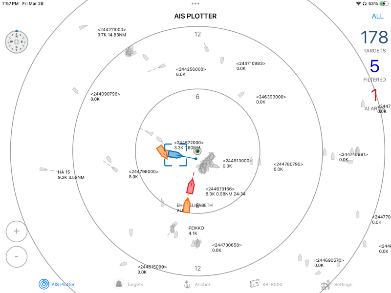

# SignalK AIS Target Prioritizer

A [SignalK](https://signalk.org/) plugin that prioritizes AIS targets according to guard and CPA criteria.

## What Does It Do?

The SignalK AIS Target Prioritizer plugin processes SignalK AIS data and applies configurable collision risk criteria to each AIS target. It calculates CPA and time to CPA (TCPA) and establishes a collision risk rating for each AIS target. This rating can be used to rank AIS targets and highlight those targets that represent the most immediate risk/danger. The plugin will also trigger warnings and alarms when AIS target vessels meet the collision risk criteria.

Sample screenshot of webapp:

## Features
- **Webapp**
  - Plots AIS targets 
  - Different symbols for Class A, Class B, ATONS, BASE, and MOB/EPIRB/SART targets
  - Show full AIS target details
  - Configurable CPA and guard warnings and alarms with separate profiles for anchored, Harbor, coastal, and offshore
  - Restore default CPA and guard warnings and alarms configuration
  - Select current active profile (anchored, Harbor, coastal, or offshore)
  - Calculates AIS target range, bearing, CPA, time to CPA (TCPA), collision risk rating, and warning/alarm status
  - Visual and audible CPA and guard alarm announcements
  - Visually highlights AIS targets that represent higher collision risk
  - Visually indicates AIS crossing situation by projecting vessel positions to the moment of CPA. This makes it very easy to understand if the target will pass ahead or behind you.
  - Lists AIS targets in order of collision risk
  - Mute alarms - such that muted vessels will no longer raise further alarms
  - Visually indicates lost AIS targets with red X
  - Supports tiled (png) and vector (**PMTiles**) maps, including SignalK chart resource API providers such as [Signal K Charts](https://github.com/SignalK/charts-plugin) and [PMTiles Chart provider](https://github.com/panaaj/signalk-pmtiles-plugin). Note that offline charts can be setup using these features. I highly recommend creating your own PMTiles maps using [Protomaps](https://docs.protomaps.com/), as the resulting files are quite small. For example, a PMTiles extracted subset covering all of French polynesia wiht zoom 1-15 comes out at 22MB.
  - Prevent screen sleep
  - Dark mode for night time use
  - Fullscreen mode

- **Plugin**
  - Calculates AIS target range, bearing, CPA, time to CPA (TCPA), collision risk rating, and warning/alarm status
  - Publishes SignalK vessel deltas containing range, bearing, CPA, time to CPA (TCPA), collision risk rating, and warning/alarm status
  - Publishes SignalK notification messages for AIS CPA and gurad warnings and alarms. These can be wired up to produce audible alarms and/or push notifications using various available notification plugins or the Node-RED plugin. This facilitates "headless" alarming.
  - Notifications can be muted using the webapp or REST API (`GET /plugins/signalk-ais-target-prioritizer/muteAllAlarms`)
  - Emulates the Vesper XB-8000 AIS - for the purpose of using the very nice Vesper WatchMate mobile apps for iOS and Android (*this may be deprecated soon, as the webapp now provides this functionality*)

**The Plugin must be running in order to use the webapp.**

## Vessel Deltas Published

The plugin emits the following SignalK deltas on the AIS targets in the SignalK data model:

| Data | Description | SignalK Path |
| --- | --- | --- |
| CPA | Closest point of approach | navigation.closestApproach Object value with property: **distance** (m)
| TCPA | Time to closest point of approach | navigation.closestApproach  Object value with property: **timeTo** (s)
| Range | Current range to target | navigation.closestApproach Object value with property: **range** (m)
| Bearing | Current bearing to target | navigation.closestApproach Object value with property: **bearing** (rad True)
| Collision Risk Rating | A numerical rating of collision risk. A low number represents higher risk. | navigation.closestApproach  Object value with property: **collisionRiskRating**
| Collision Alarm Type | "guard", "cpa" | navigation.closestApproach collisionRiskRating Object value with property: **collisionAlarmType**
| Collision Alarm State | "warn", "danger" | navigation.closestApproach Object value with property: **collisionAlarmState**

## Configuration

The configuration consists of the **Collision Profile** criteria used to evaluate collision risk:

* **Collision Warning** - Configured using CPA, TCPA, and target SOG threshholds. Trips an **CPA Warning** when a target vessel meets these conditions. Intended to warn you of targets approaching your **Collision Alarm** thresholds. 
* **Collision Alarm** - Configured using CPA, TCPA, and target SOG threshholds. Trips an **CPA Alarm** when a target vessel meets these conditions.
* **Guard Alarm** - Configured using target Range and SOG threshholds. Trips an **Guard Alarm** when a target vessel meets these conditions.

There are four sets of the above criteria for different navigation situations:

* **Anchored**
* **Harbor**
* **Coastal**
* **Offshore**

## Vesper XB-8000 AIS Emulation

**Warning: this functionality may be deprecated soon as the webapp provides equivalent functionality**

This plugin emulates the Vesper XB-8000 AIS - for the purpose of using the very nice Vesper WatchMate mobile apps for iOS and Android to get a nice visual representation of the AIS targets and their associated collision risk. Install the Watchmate app on your mobile device, point it at the IP of your SignalK server, and the app will merrily connect as if it were a Vesper AIS. The Watchmate app will display the live AIS data from your SignalK server with the target prioritization. The sample screenshot below is from my development using the SignalK team's sample NMEA/AIS data.

Note that not everything works in these apps when used this way. This is a work in progress. Stuff that works at this point:

* AIS Plotter
* Target List / Table
* Trigger alarms for Guard, CPA, and MOB/EPIRB/SART transponder detections
* Select and edit collision profiles (guard and CPA alarm thresholds)
* Anchor Watch works on the Android app, but not the iOS app

Proprietary functionality intended for configuring the Vesper AIS obviously does not and never will.

Sample screenshot of WatchMate on an iPad:

The Vesper Watchmate mobile app can be installed using the links below.

 

## Other Ideas

Not implemented, but possible:

* Activate a piezo buffer on the Raspberry Pi running SignalK when an alarm is triggered
* Use a physical momentary switch on the Raspberry Pi to ack and hush alarms
* Automatically switch from an underway profile (e.g. coastal) to the anchored profile when the vessel stops moving. Could also automatically turn on the anchor alarm as well. And vice-versa - turn off the anchor alarm and switch back to an underway profile when you get going again. 
